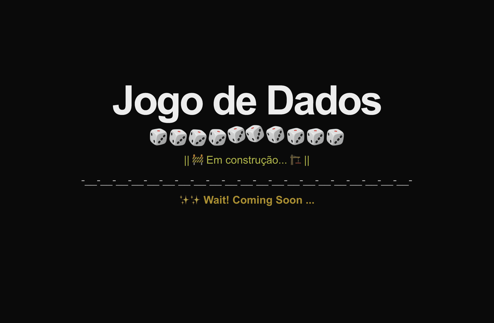

<div align="center">


# 🎲 Neon Dice

**Duelo local de dados para duas pessoas no mesmo aparelho**

Sala com nomes e skins · Dados 3D · Cinco rodadas · Um botão Jogar por vez · Save neste navegador

<br />

[](https://joga-dados-unicap.vercel.app)
[](https://github.com/VANESSENCEWEB/jogo-dados-unicap)

<br />


<br />

**[🌐 Ver ao vivo](https://joga-dados-unicap.vercel.app)** ·
**[📸 Screenshots](#-screenshots)** ·
**[🛠️ Stack](#️-stack-técnica)** ·
**[💡 Decisões](#-decisões-técnicas)** ·
**[🚀 Local](#-rodando-localmente)**

</div>

---

## 📖 Sobre o projeto

O **Neon Dice** é o jogo de dados da disciplina de Sistemas para Internet (UNICAP). Nasceu do enunciado — dois jogadores, cinco rodadas, maior soma vence — e foi tratado como **produto**: histórico de commits por bloco, deploy na Vercel e layout que cabe no celular sem esconder o que o professor pede.

Na mesa, a pessoa vê:

- 🎯 **A rodada atual** (1 de 5 até 5 de 5)
- 🎲 **Os dois dados de cada jogador** e a soma
- 📣 **O resultado da rodada** com o texto do enunciado: Jogador 1 venceu · Jogador 2 venceu · Empate
- ▶️ **Os dois botões Jogar** o tempo todo, com **só um habilitado** por vez
- 🏁 **O fim da partida**: Jogador 1 venceu · Jogador 2 venceu · Empate geral + **Jogar Novamente**

## 📸 Screenshots

<table>
  <tr>
    <td align="center" width="50%">
      
      <br />
      <sub><b>🌐 Produção</b> · https://joga-dados-unicap.vercel.app</sub>
    </td>
    <td align="center" width="50%">
      
      <br />
      <sub><b>🧱 Dia 1</b> · Next.js no ar, tela em construção</sub>
    </td>
  </tr>
</table>

## 🎥 Demo em vídeo

A atividade pede um vídeo de **até 30 segundos** do site publicado (não do localhost): os dois jogando, um botão ativo por vez, o texto da rodada e o **Jogar Novamente** no fim.

Quando o link do YouTube (público ou não listado) estiver pronto, ele entra aqui e no badge do topo.

## 🛠️ Stack técnica

<table>
<tr>
<td width="33%">

**Frontend**
- Next.js 16 (App Router)
- React 19
- CSS 3D (cubo do dado)
- Skins Neon, Pink, Clássico e Ouro

</td>
<td width="33%">

**Lógica & dados**
- `lib/regras.js` (funções puras)
- localStorage (perfil, som, placar)
- Route Handler `/api/sugestoes`
- randomuser.me com fallback local

</td>
<td width="33%">

**Infra**
- Vercel (produção)
- GitHub (`jogo-dados-unicap`)
- Conventional Commits
- Metadata / Open Graph no `layout.js`

</td>
</tr>
</table>

## ✨ Features destacadas

### 🎲 Cubo 3D com skins
O dado não é um SVG estático na mesa: é um cubo CSS com seis faces. A skin escolhida na sala (ciano, pink, clássico ou ouro) segue o jogador até o fim da partida.

### 🧍 Sala em dois passos
Jogador 1 entra primeiro, depois Jogador 2. Nome digitado ou gerado na API. **Entrar na mesa** só depois dos dois.

### 🔒 Turno travado
Os dois botões **Jogar** ficam visíveis. `disabled` no que não é a vez, inclusive durante a rolagem. No celular o hamburger guarda som, tela cheia, reset e o guia **Como jogar**.

### 💾 Save neste navegador
Perfil, tema, som e partida em andamento gravam sozinhos. **Jogar Novamente** recomeça com os mesmos nomes. Resetar limpa a temporada.

## 💡 Decisões técnicas

Cada escolha abaixo dá para defender na apresentação:

<details>
<summary><b>1. Regras fora do React</b></summary>

`rolarDado`, `somaDados`, `resultadoRodada` e `resultadoPartida` vivem em `lib/regras.js`. A interface só desenha. Fica mais fácil testar a frase do enunciado sem montar a tela.

</details>

<details>
<summary><b>2. Textos oficiais na rodada e na partida</b></summary>

A soma usa os nomes na mesa. O placar da rodada e o resultado final usam **Jogador 1 venceu**, **Jogador 2 venceu**, **Empate** e **Empate geral** — como o PDF da disciplina pede.

</details>

<details>
<summary><b>3. API de nick no servidor</b></summary>

O `fetch` da sugestão de nome passa por `app/api/sugestoes/route.js`. Se a randomuser.me cair, o Route Handler devolve um nick da lista local. O jogo não trava sem internet.

</details>

<details>
<summary><b>4. Metadata no Server Component</b></summary>

Favicon, descrição e Open Graph saem de `app/layout.js` + `app/opengraph-image.jpg`. Não é `next/head` no cliente: o HTML já chega com as `<meta>` que o WhatsApp lê.

</details>

## 🎓 O que este projeto demonstra

- ✅ **Enunciado coberto** — 2 jogadores, 5 rodadas, textos oficiais, um Jogar por vez, Jogar Novamente
- ✅ **App Router** — Server Components no `layout` / `page`, Client Components no jogo
- ✅ **Estado de UI** — turno, rolagem, histórico e fim de partida
- ✅ **API própria** — Route Handler com fallback
- ✅ **Persistência** — localStorage sem conta
- ✅ **Responsividade** — mesa e sala no celular, hamburger para o guia
- ✅ **Git** — commits pequenos, Conventional Commits, um bloco por mensagem
- ✅ **Deploy** — Vercel ligado no repositório unicap

## 🚀 Rodando localmente

**Requisitos**: Node.js 20+ (o projeto usa Next 16).

```bash
git clone https://github.com/VANESSENCEWEB/jogo-dados-unicap.git
cd jogo-dados-unicap

npm install
npm run dev
```

Abra [http://localhost:3000](http://localhost:3000).

```bash
npm run build
npm start
```

## 📂 Estrutura

```
jogo-dados/
├── app/
│   ├── api/sugestoes/route.js   # GET de nick (API + fallback)
│   ├── layout.js                # fontes, metadata, Open Graph
│   ├── page.js                  # rota /
│   ├── globals.css              # visual neon + media queries
│   ├── icon.png                 # favicon
│   └── opengraph-image.jpg      # preview de redes
├── components/
│   ├── JogoDados.jsx            # estado da partida
│   ├── Lobby.jsx                # sala (Jogador 1 → Jogador 2)
│   ├── PainelJogador.jsx        # dados + botão Jogar
│   ├── Dado.jsx                 # cubo 3D
│   ├── MenuApp.jsx              # header + hamburger
│   └── GuiaJogo.jsx             # como jogar
├── lib/
│   ├── regras.js                # 5 rodadas, soma, textos oficiais
│   ├── temas.js                 # skins
│   ├── storage.js               # save
│   └── som.js                   # áudio da rolagem
├── hooks/
│   ├── useSugestaoNick.js
│   └── useTelaCheia.js
├── public/
│   ├── dados/                   # SVGs 1–6 (dia 1)
│   └── video-dados.mp4          # fundo da mesa
└── docs/progresso/dia-1.png
```

## 🗺️ Acompanhamento

Prints do fim de cada dia, como combinado no README inicial.

| Dia | Data | O que entrou |
|---|---|---|
| 1 | sexta 11/09 | Next.js + tela em construção |
| 2 | sábado 12/09 | dados e layout dos dois jogadores |
| 3 | domingo 13/09 | regras, turno e resultado da rodada |
| 4 | segunda 14/09 | mesa final, Vercel, README |

## 👩‍💻 Sobre a autora

<table>
<tr>
<td width="150" align="center">
<a href="https://github.com/VANESSENCEWEB">

</a>
</td>
<td>

**Vanessa Rafaella Carneiro de Lima**

Estudante de Sistemas para Internet na UNICAP (Pernambuco, Brasil).
Fundadora da VanessenceWeb Ltd (UK). Apaixonada por front-end, UX e qualidade de código.

[](https://linkedin.com/in/vanessa-lima-web)
[](https://github.com/VANESSENCEWEB)

</td>
</tr>
</table>

## 🙏 Créditos

- **Vercel** — deploy e domínio `joga-dados-unicap.vercel.app`
- **randomuser.me** — sugestão opcional de nome
- **UNICAP** — enunciado da atividade

---

<div align="center">

**Se este projeto te inspirou, considera dar uma ⭐ no repositório!**

Feito com 💙 em Recife · Pernambuco · Brasil

</div>
